# Html

## Html is stands for Hypertext Markup Language. We use it to make website by specific key words.


<br/>

*Any website you want to build you need to structure it like main head then paragraph and sub head and another paragraph and so on…*

<br/>


<br/>

Html use something called tags and each tag has deference purpose ex:
`<p></p>`  to make paragraph.
`<a><a/>`  to make links 


Tags syntax 
<  p  >  < / p >

<br/>

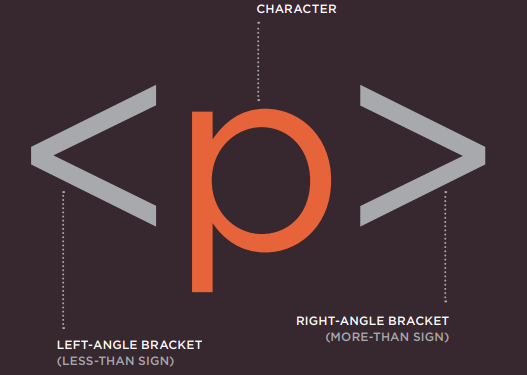

<br/>

**You have to start tag and close tag and put your text inside.`<p> your text </p>`**

<br/>

Html structure
```
<html>
<head>
<title></title>
</head>
<body>
</body>
</html>

```

Any things inside html tag will consider like web page, also you see we have head tags this tag hold information for page only and title tag for page name, for body tag this for show all your content on web browser window.

***There is attributes we use them for add extra information for tags, and tags some time has specific attribute can't use them with other tags. `<p lang='en'>`***

<br/>
You can start write html code in node pad and save the file in .html extension and open it, but also you can you other third-party text editor to write html code.


<br/>

### Content Management System 
If you don't have experience with html or you don’t want to learn html and you want to make website, you can use Content Management System, this allow you to edit parts in page without deal with html tags.

> To see other age tags you can go to the website, right click and view source.

<br/>

## The Evolution of HTML


Html through variety of changes, we have html 4 this html has problem so they update it to xhtml to make it formal and follow these rules :

* Every element needed a closing tag (except for empty elements such as Attribute names had to be in lowercase.
* All attributes required a value, and all values were to be placed in double quotes. 
* Deprecated elements should no longer be used. 
* Every element that was opened inside another element should be closed inside    that same element. 


> Now we have html 5 that is enhance to html 4 with more tags.


## DOCTYPEs

***We use DOCTYPE to tell browser  which html version you will use***

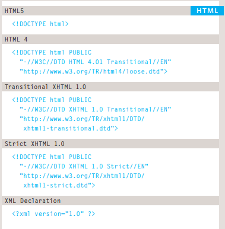

<br/>

## Other features

`<!-- -->` We use these to make comment and hide something from user, and also like a guide for programmers and order section inside the html.

Id attribute `id="a"` we use it to get specific tag and use it with css and javascript.

Class attribute `class="sep"` we use it for css to add styles.

Block Elements is tag like `<p>` or `<h>`  that put line before and after, when you add element his worder will above each other. 

Inline element is tag like `<pan>` or ``, her all tage come side by side.

Div `<div>` element to contain other element to make section.

<br/>

***The most common reason why people use elements is so that they can control the appearance of the content of these elements using CSS.***

<br/>

Iframe `<iframe>` to show page in another page with these attribute, and iframe has some attributes:

1. src  URL of the page to show in the frame. 
1. height specifies the height of the iframe in pixels.
1. width specifies the width of the iframe in pixels


<br/>

meta `<meta>` tag is to hold information about page in order to search engine about your page, Meat data has attribute :

+ Description to tell search engine about your page and max 155 char.
- Keywords it's about key words you added to make it easy to search engine to  fine your page.
* Author we use it to tell whos own the site.
+ Pragma to not make browser from cash the site.
- Expires to tell browser when to delete cash.

<br/>


## Escape Characters

It is special characters like @ … etc , if you what to add it you need something called escape codes or entity references

<br/>

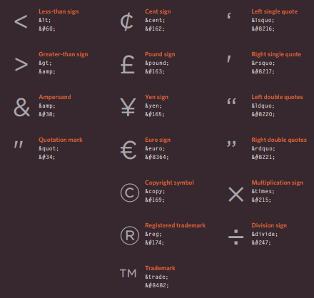

<br/>


## Traditional HTML Layouts

web page authors used elements to group together related elements on the page (such as the elements that form a header, an article, footer or sidebar). Authors used class or id attributes to indicate the role of the 
element in the structure of the page.

<br/>

old          |     new
  -----------|----------
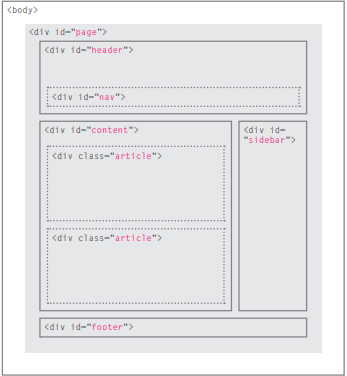 | 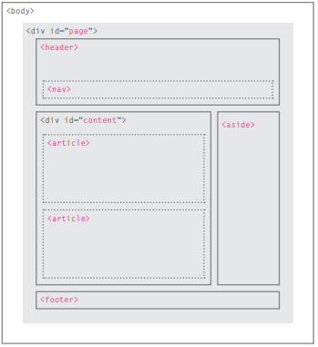


<br/>

## New Html5 Layout Elements

<br/>

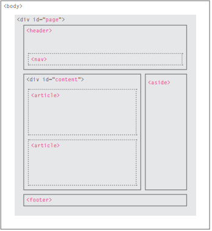

<br/>

 > `<header> <footer>` The main header or footer that appears at the top or bottom of every page on the site.

 > `<nav>` is used to contain the major navigational blocks on the site such as the primary site navigation.

> `<article>` acts as a container for any section of a page that could stand alone and potentially be syndicated.

> `<aside>` element is used inside an element, it should contain information that is related to the article, When the element is used outside of an element, it acts as a container for content that is related to the entire page.

> `<section>` groups related content together, and typically each section would have its own heading. on a homepage there may be several elements to contain different sections of the page

> `<hgroup>` The purpose of the element is to group together a set of h1 to h6

> Figures should also contain a element which provides a text decription for the content of the element. It can be used to contain any content that is referenced from the main flow of an article (not just images)
Examples of usage include: Images ● Videos ● Graphs ● Diagrams ● Code samples ● Text that supports the main body of an article.


<br/>

## Older browsers

*Older browsers that do not know the new HTML5 elements will automatically treat them as inline elements. Therefore, to help older browsers, you should include the line of CSS on the left which states which new elements should be rendered as block-level elements.*

<br/>

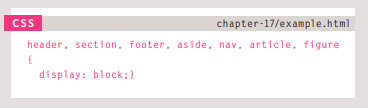

<br/>


## Design

***There are several question you need to answer before start build the website:***

- [x] Who is the Site For?
> Ex: man or women , incoum visitor ….etc you need to collect more information about who will use this site.
- [x] Why people visite your web site? What is reason? 
> is it easy for users to get what they want fast or need some additional help? 

**After answer these question you need to do:**

1. a map

<br/>

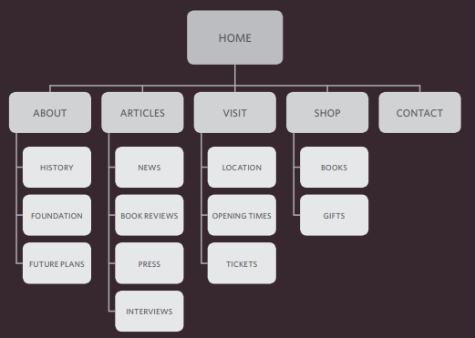

<br/>

1. WireFrames

<br/>

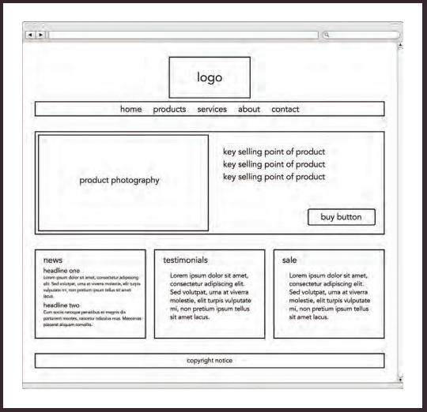

<br/>


## JAVASCRIPT

<br/>
<br/>
<br/>


## **Javascript is a programing language that you can use it to make webpage more dynamic and interactive, also you can use it to manipulates and adjust css and html tags.** 


### Examples :

* Change attrubites (id, style , class...  etc).
* Change text inside tages and get text.
* Add event listner (click, hover .... etc).
* Add enimation (slidup, shake).
* Add information from forms and validate inputs.


## Before starting write code please take those steps:

1. DEFINE THE GOAL: First, you need to define the task you want to achieve.
1. ESIGN THE SCRIPT: To design a script you split the goal out into a series of tasks.
1. CODE EACH STEP: Each of the steps needs to be written in a programming language that the compu ter
understands. 
1. Use flowcharts: Arrows show how the script moves from one task to the next. The different shapes represent diff€rent types of tasks.

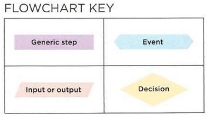

<br/>

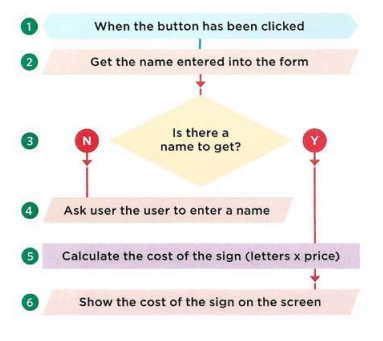

<br/>

## RULES FOR NAMING VARIABLES

***We have rules to name varibales:***

* It must start with letter, $ , _.
* It can contain letters,numbers, dollar sign ($),or an underscore (_).
* You cannot use keywords or reserved words (var , function ... etc)
* javascript is a case sensitive small letter is different from capital.

## EXPRESSIONS
<br/>

> var x= 55;

<br/>

## OPERATORS

<br/>

> var x= 5>5;
> var x= 5==5;
> var x= (5 > 3) && (2 < 4);

<br/>

## Functions 

<br/>

Functions let you group a series of statements together to perform a
specific task.


```

function nameOfFunction ( arrguments ...)
{

    statments
        .
        .
        .
        .
    return value    
}


```
